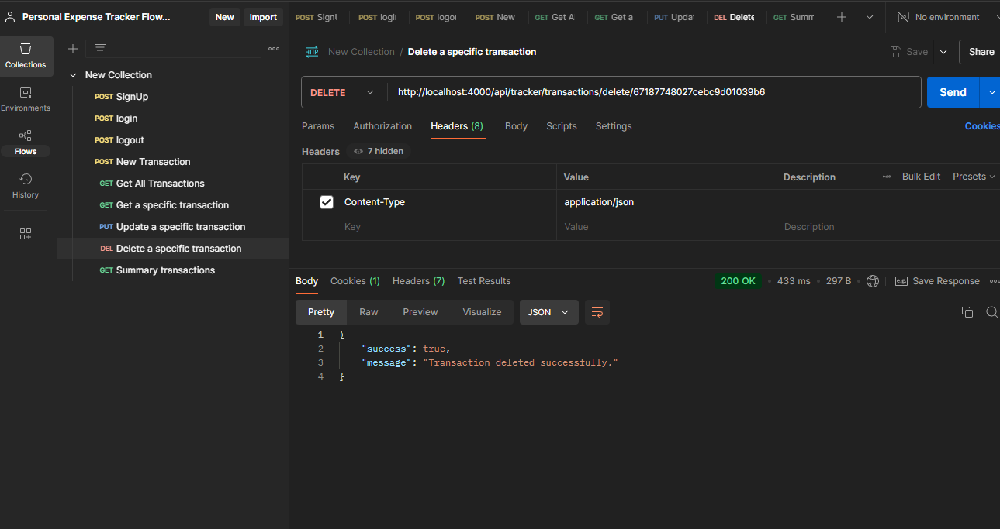

# Setup & Run Instructions

```
gite clone https://github.com/subham-rakshit/Personal-Expense-Tracker-Floww-Ai

cd project_name

npm init
npm install

npm run dev
```

## Step 1: Create a new user (SignUp)

User can SignUp by their `firstName`, `lastName`, `password`. Before user details save in to database, password will be hashed by bcrypt. And if user details already present in database then a response message will be come with `It looks like you're already registered. Please Login to your account`. If not then a new user will be created and store and a jwt_token will store in cookies for authentication and authorization purposes.


## Step 2: Login by user details

If user is already exist in database then user can login by their `firstName`, `lastName`, `password`. If user details not found in database then a response message will come with `User not found. If you don't have an account, please SignUp first`. Thenpassword will be compared by the jwt signature. If it is matched then Login sucessfull message will come.


## Step 3: Create a new Transaction

Only register user can create a new transaction by providing type, category, amount, date, description. All checks are there for each inputs. And also user id include for authorization purposes. Also name and type will store in Category collection.


## Step 4: Get all transactions

Only register user can view their own transactions.


## Step 5: Get a specific transactions

Only register user can view their own specific transaction.


## Step 6: Update a specific transactions

Only register user can update their own specific transaction.


## Step 6: Delete a specific transactions

Only register user can delete their own specific transaction.


